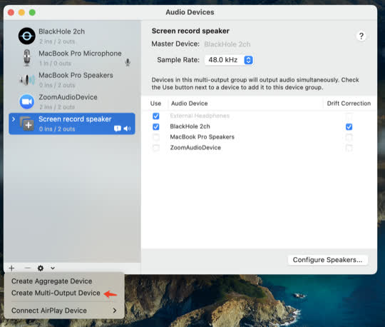
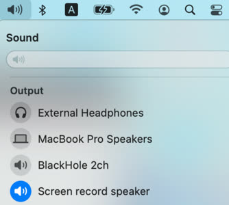

# Install
First, install blackhole-2ch. You may use the below command or follow this [guide](https://github.com/ExistentialAudio/BlackHole#installation-instructions).

```sh
brew install blackhole-2ch
```

Second, create a **multi-output device** in `audio midi Setup`, which should be found from Spotlight or Lauchpad. The multi-output device should *use* both your favour speaker and Blackhole 2ch. And your favour speark should be above Blackhole 2ch.




Third, install python dependencies:

```sh
pip install sounddevice==0.4.4 vosk==0.3.43
```

# Usage
Just run the below command, and for the application you live caption, select the **multi-output device** as its speaker.

```sh
python main.py
```



# Help

```sh
python main.py -h
```

Available models are listed [here](https://alphacephei.com/vosk/models). Have fun with that.
